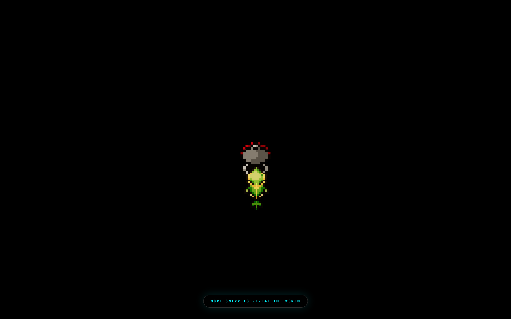
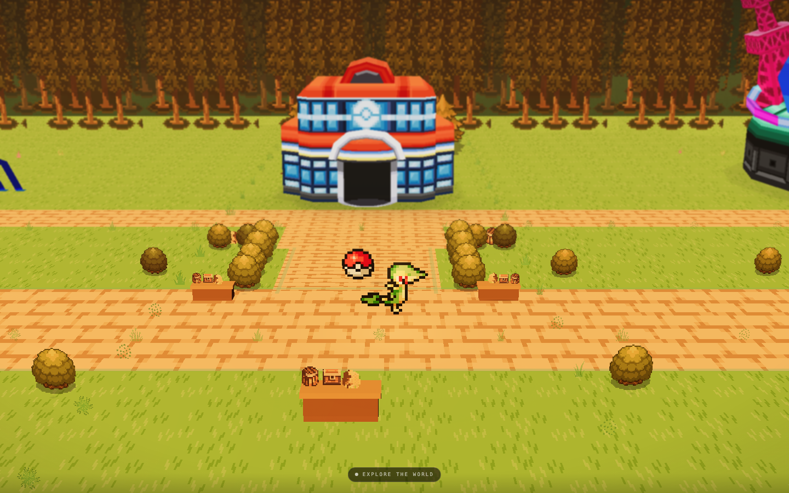
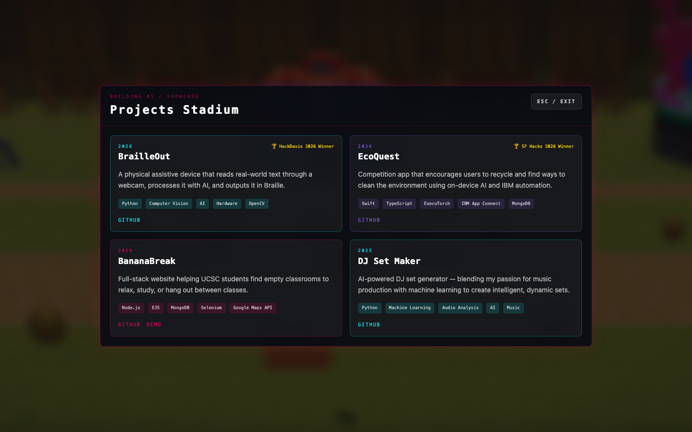
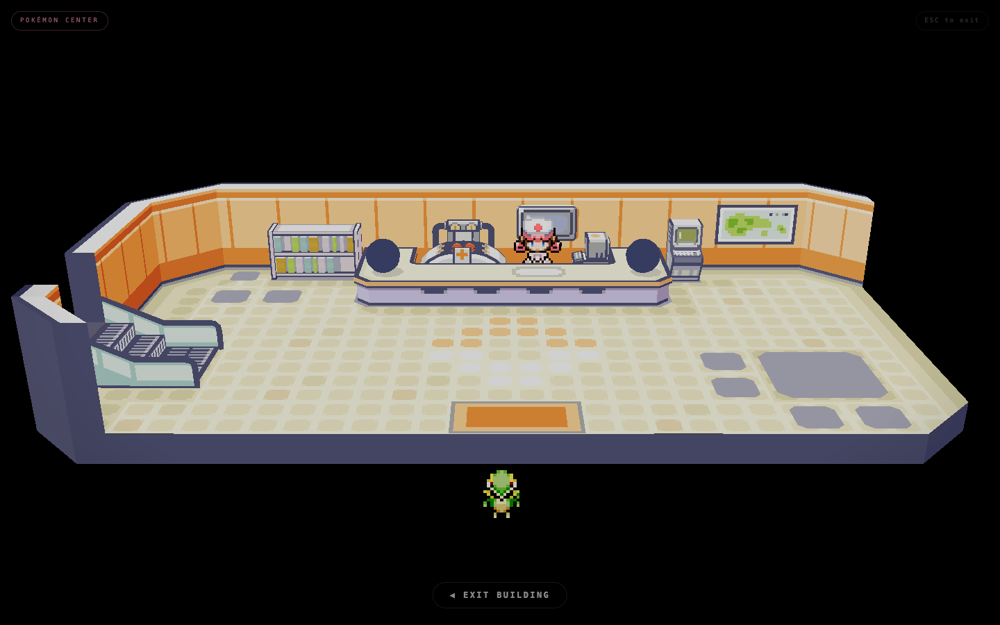
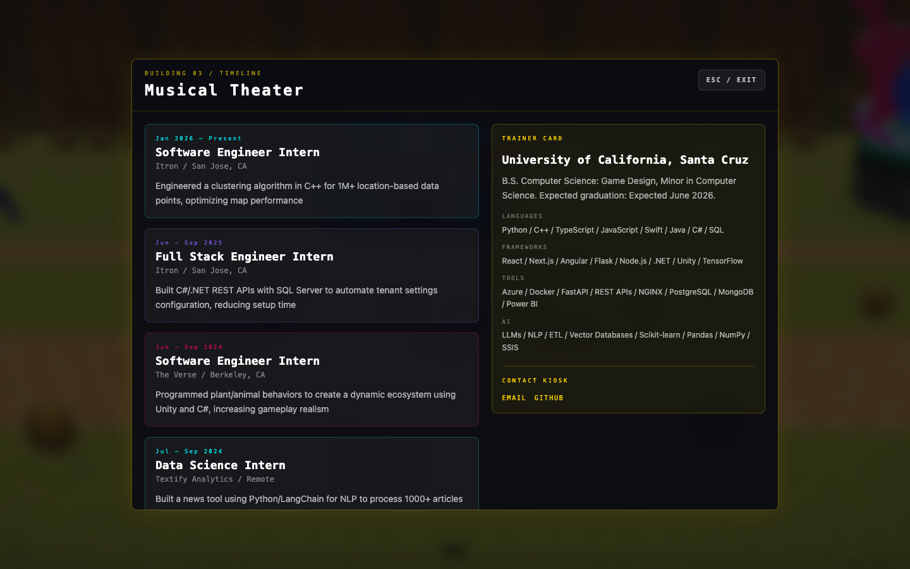

# Varun Palanisamy — Interactive Portfolio

A Pokémon-style interactive portfolio built in Next.js. Instead of scrolling through a webpage, you explore an HD2D world, walk into buildings, and discover my work the way you'd discover a town in a Pokémon game.

---

## How it works

When you open the site, a Pokéball appears on a black screen. Press any key to advance through the opening cutscene — your Snivy emerges from the ball and you're dropped into the world. Move Snivy with **WASD** or **arrow keys** to reveal the map, then walk north to reach the back promenade where three buildings stand.

Each building is a section of the portfolio:

| Building | Section |
|---|---|
| **Pokémon Center** | About — walk inside to meet Nurse Joy and see the healing station |
| **Projects Stadium** | Projects — a panel of all my builds with links and tech tags |
| **Musical Theater** | Experience — internship timeline and education |

Walk up to any building and press **W / ↑** to enter. Press **ESC** to exit back to the world.

---

## Screenshots

### Opening sequence
> A pixel Pokéball floats in on a black screen. Press any key to begin.


---

### Snivy spawn
> Your starter Pokémon appears. Move to reveal the world hidden in the dark.



---

### The world
> An HD2D town built with Three.js / React Three Fiber. The Pokémon Center, Projects Stadium, and Musical Theater sit along the back promenade. Walk around freely — a Pokéball sits at the center of the main path.



---

### Projects Stadium
> Enter the stadium to see all my projects: BrailleOut (HackDavis 2026 winner), EcoQuest (SF Hacks 2026 winner), BananaBreak, and DJ Set Maker.



---

### Pokémon Center — About
> Step inside the Pokémon Center. Nurse Joy stands at the healing counter. The interior is rendered as a full isometric 3D scene.



---

### Musical Theater — Experience
> Enter the theater to see my engineering experience at Itron, The Verse, and Textify Analytics, alongside my education at UC Santa Cruz.



---

## Tech stack

| Layer | Tools |
|---|---|
| Framework | Next.js 14, React 18, TypeScript |
| 3D / World | Three.js, React Three Fiber (`@react-three/fiber`), Drei, Postprocessing |
| Game engine | Phaser 4 (legacy 2D map layer) |
| Animation | Framer Motion, GSAP |
| Audio | Howler.js, Tone.js |
| Styling | Tailwind CSS |

The world is rendered entirely in WebGL via React Three Fiber. The HD2D effect (flat sprites in a 3D environment) is achieved with custom GLSL shaders in [lib/hd2d/shaders.ts](lib/hd2d/shaders.ts). Building interiors are separate React components ([PCInteriorScene.tsx](components/PCInteriorScene.tsx), [SwitchInteriorScene.tsx](components/SwitchInteriorScene.tsx)) swapped in on entry.

---

## Running locally

```bash
npm install
npm run dev
```

Open [http://localhost:3000](http://localhost:3000).

> **Note:** `public/audio/` (music stems) and `public/hd2d/` (HD2D asset packs) are excluded from this repo. The world will load without them — audio simply won't play.

---

## Contact

- **Email:** varun.palanisamy@gmail.com
- **GitHub:** [github.com/varunpalanisamy](https://github.com/varunpalanisamy)
